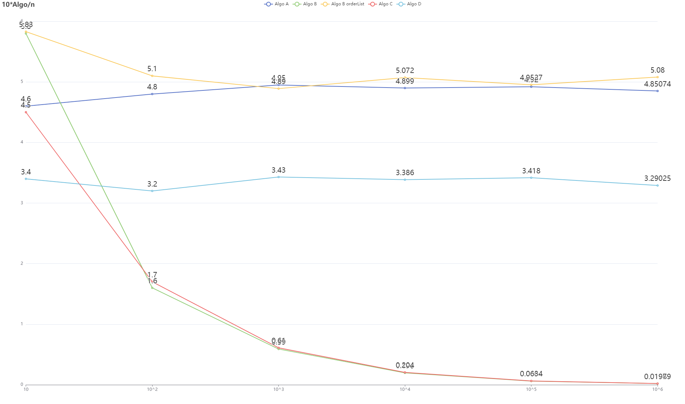
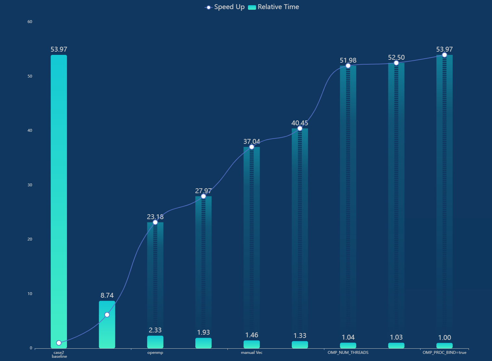
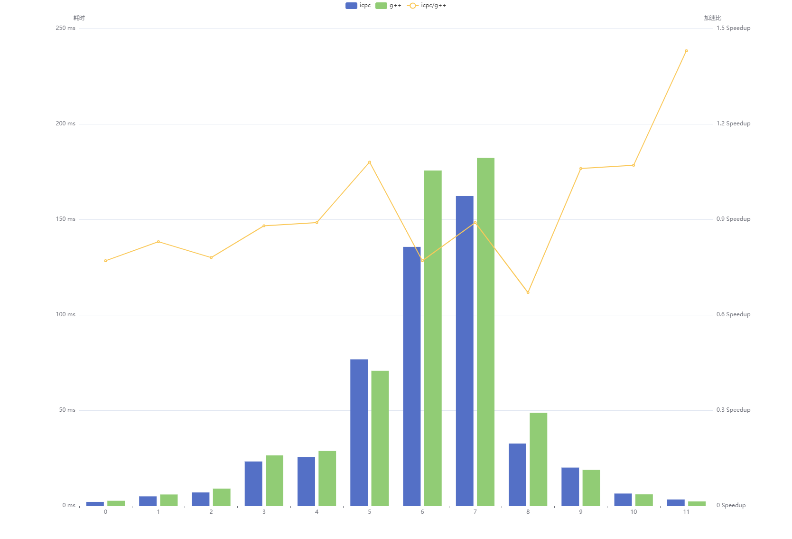
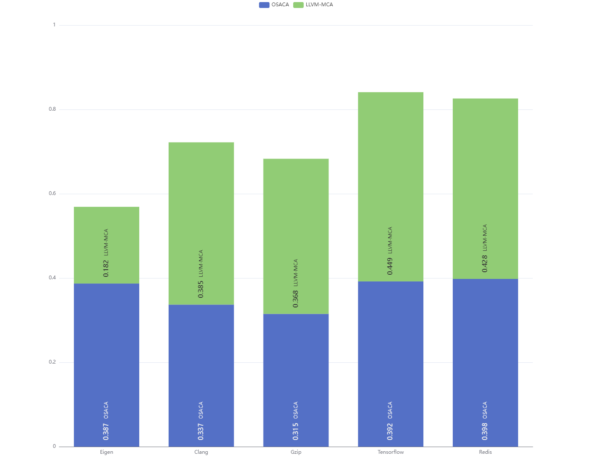
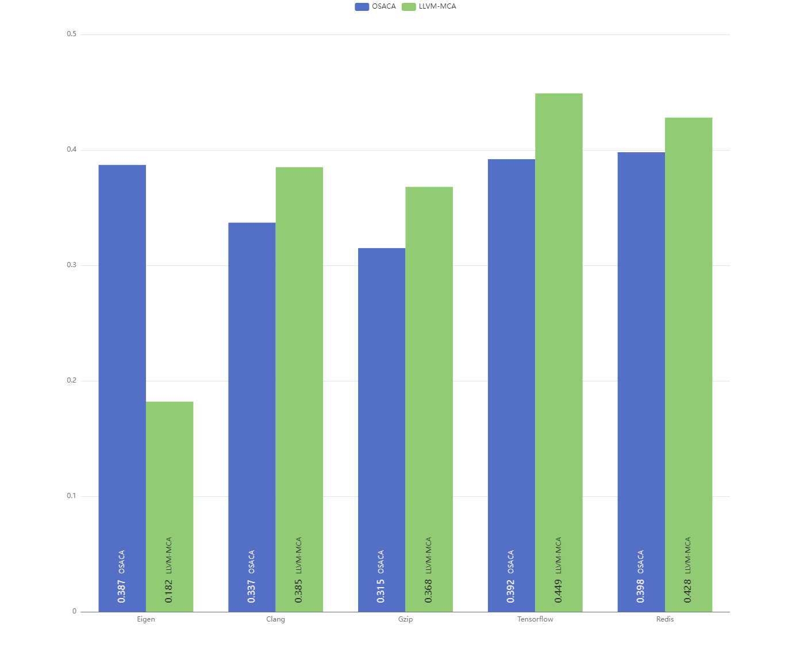
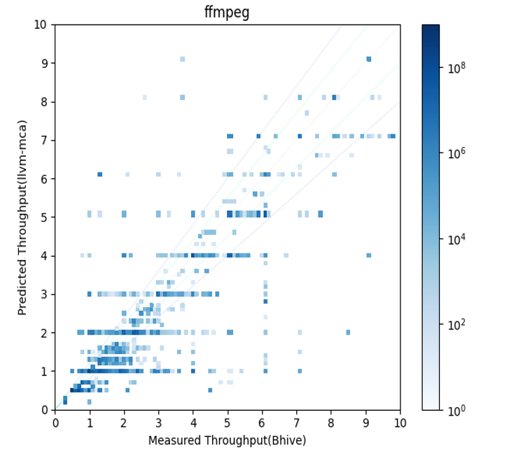
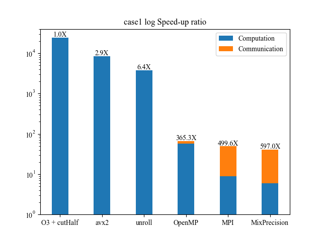
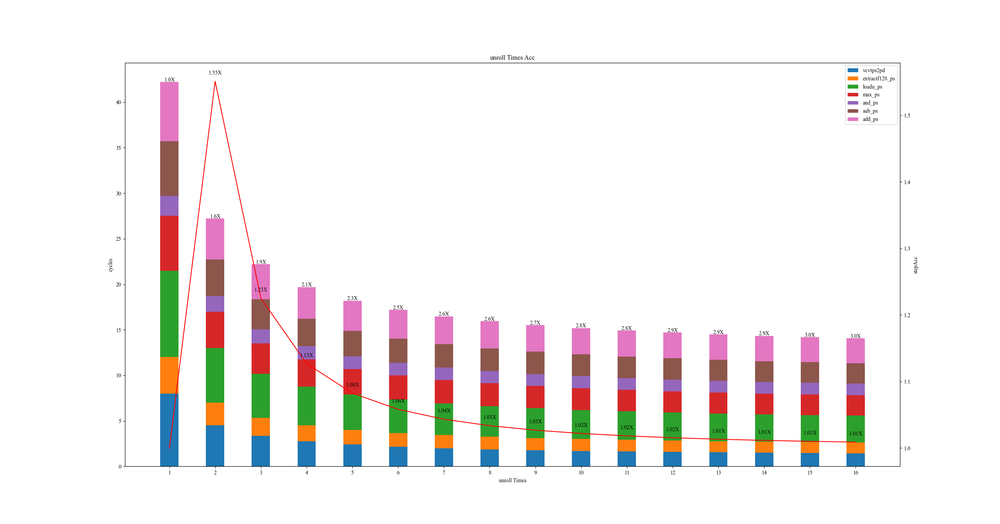

# chart-gallery

## [echart3](https://echarts.apache.org/examples/en/editor.html?c=pictorialBar-dotted)

### fig1 [[SRC]](./echarts/fig1/fig1.js)

### fig2 [[SRC]](./echarts/fig2/fig2.js)

### fig3 [[SRC]](./echarts/fig3/fig3.js)

### fig4 [[SRC]](./echarts/fig4/fig4.js)

## matplotlib

### fig1 [[SRC]](./matplotlib/fig1/fig1.py)

### fig2 [[SRC]](./matplotlib/fig2/fig2.py)

### fig3 [[SRC]](./matplotlib/fig3/fig3.py)
